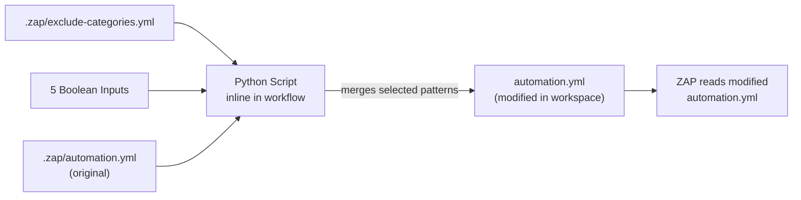

# Module 1: GitHub Actions Workflow

**File:** `dastscanner.yml`

---

## Purpose

The GitHub Actions workflow is the **orchestrator** of the entire DAST pipeline. It handles:

- Triggering (manual or scheduled)
- Target URL resolution and safety validation
- Merging dynamic exclusion toggles into the static scan plan
- Launching OWASP ZAP in Docker
- Uploading results to GitHub Code Scanning and as artifacts

---

## Flowchart: Workflow Execution

```mermaid
flowchart TD
    START([Trigger]) --> TRIGGER_TYPE{Trigger Type?}

    TRIGGER_TYPE -->|Manual<br/>workflow_dispatch| MANUAL_INPUTS[Collect Inputs:<br/>target-url, allow-production,<br/>confirm-authorized, 5 exclusion toggles]
    TRIGGER_TYPE -->|Scheduled<br/>cron 0 2 * * 1-5| CRON_DEFAULTS[Use Defaults:<br/>target = DAST_STAGING_URL<br/>all exclusions ON]

    MANUAL_INPUTS --> VALIDATE_TARGET
    CRON_DEFAULTS --> VALIDATE_TARGET

    VALIDATE_TARGET{Target URL Valid?}
    VALIDATE_TARGET -->|URL contains "prod"| REJECT_PROD[REJECT:<br/>Production URL detected.<br/>Set allow-production: true]
    VALIDATE_TARGET -->|confirm-authorized ≠ "yes"| REJECT_AUTH[REJECT:<br/>Authorization not confirmed]
    VALIDATE_TARGET -->|✓ Valid| RESOLVE_URL[Resolve URL<br/>from input or DAST_STAGING_URL]

    RESOLVE_URL --> MERGE_EXCLUSIONS[Merge Exclusion Toggles<br/>into automation.yml]

    MERGE_EXCLUSIONS --> LAUNCH_DOCKER[Launch ZAP Docker Container<br/>ghcr.io/zaproxy/zaproxy:stable]

    LAUNCH_DOCKER --> INSTALL_ADDONS[Install Add-ons:<br/>postman, authhelper, graaljs]
    INSTALL_ADDONS --> RUN_ZAP[Run ZAP Autorun<br/>zap.sh -cmd -autorun .zap/automation.yml]

    RUN_ZAP --> ZAP_EXIT{ZAP Exit Code?}

    ZAP_EXIT -->|0| NO_HIGH[No High-risk findings<br/>✓ Pass]
    ZAP_EXIT -->|2| MEDIUM_FOUND[Medium-risk findings<br/>⚠ Warning — job still passes]
    ZAP_EXIT -->|other| HIGH_OR_FAIL[High-risk findings or<br/>scan failure ✗ Fail]

    NO_HIGH --> UPLOAD_SARIF[Upload SARIF to<br/>GitHub Code Scanning]
    MEDIUM_FOUND --> UPLOAD_SARIF
    HIGH_OR_FAIL --> UPLOAD_SARIF

    UPLOAD_SARIF --> UPLOAD_ARTIFACTS[Upload Reports as Artifacts<br/>zap-dast.json + zap-dast-report.html<br/>30-day retention]

    UPLOAD_ARTIFACTS --> END([Done])

    style REJECT_PROD fill:#ff6b6b,color:#fff
    style REJECT_AUTH fill:#ff6b6b,color:#fff
    style NO_HIGH fill:#51cf66,color:#fff
    style MEDIUM_FOUND fill:#ffd43b,color:#000
    style HIGH_OR_FAIL fill:#ff6b6b,color:#fff
```

---

## Inputs (Manual Trigger Only)

| Input | Type | Default | Description |
|-------|------|---------|-------------|
| `target-url` | `string` | *(empty)* | Base URL to scan. Falls back to `DAST_STAGING_URL` repo variable if empty. |
| `allow-production` | `boolean` | `false` | Must be `true` to scan a URL containing "prod". |
| `confirm-authorized` | `string` | *(required)* | Must be exactly `"yes"` — explicit human authorization. |
| `exclude-sms-otp` | `boolean` | `true` | Exclude `/auth/resend-otp` (real SMS cost). |
| `exclude-job-notifications` | `boolean` | `true` | Exclude job create/redispatch/quote/cancel/complete. |
| `exclude-chat-contact` | `boolean` | `true` | Exclude chat send, contact form, waitlist. |
| `exclude-payment-bank` | `boolean` | `true` | Exclude payment session, bank resolve, withdrawals. |
| `exclude-destructive` | `boolean` | `true` | Exclude irreversible DELETE endpoints. |

---

## Target URL Resolution

```mermaid
flowchart LR
    INPUT{target-url<br/>provided?} -->|Yes| USE_INPUT[Use provided URL]
    INPUT -->|No| CHECK_VAR{DAST_STAGING_URL<br/>repo variable set?}
    CHECK_VAR -->|Yes| USE_VAR[Use DAST_STAGING_URL]
    CHECK_VAR -->|No| FAIL[FAIL:<br/>No target URL configured]

    USE_INPUT --> VALIDATE{Contains "prod"?}
    USE_VAR --> VALIDATE

    VALIDATE -->|Yes| GATE{allow-production<br/>= true?}
    VALIDATE -->|No| READY[✓ URL Ready]

    GATE -->|Yes| READY
    GATE -->|No| BLOCK[BLOCKED:<br/>Production safety gate]
```

---

## Exclusion Toggle Merge Step

The workflow runs an **inline Python script** that:

1. Reads `.zap/exclude-categories.yml` (the static exclusion patterns)
2. Evaluates the 5 boolean workflow inputs
3. For each enabled toggle, collects its URL patterns
4. Appends those patterns to the User and Provider context `excludePaths` in `.zap/automation.yml`
5. Writes the modified YAML back to the workspace

This is a **runtime mutation** — the committed `automation.yml` never changes. The merge happens in the ephemeral GitHub Actions workspace.



---

## Permissions

```yaml
permissions:
  contents: read          # Checkout the repo
  security-events: write  # Upload SARIF to Code Scanning
```

---

## Runner Configuration

| Setting | Value |
|---------|-------|
| Runner | `ubuntu-24.04-arm` |
| Timeout | 240 minutes (4 hours) |
| Docker image | `ghcr.io/zaproxy/zaproxy:stable` |

---

## ZAP Exit Code Semantics

| Exit Code | Meaning | Pipeline Behavior |
|-----------|---------|-------------------|
| `0` | No High-risk findings | ✅ Job passes |
| `2` | Medium-risk findings present | ⚠️ Job passes (warning) |
| Other | High-risk findings or scan failure | ❌ Job fails |

---

## Required Secrets

| Secret | Injected As | Used By |
|--------|-------------|---------|
| `DAST_ADMIN_USERNAME` | `DAST_ADMIN_USERNAME` env var | ZAP Admin context |
| `DAST_ADMIN_PASSWORD` | `DAST_ADMIN_PASSWORD` env var | ZAP Admin context |
| `DAST_USER_PHONE` | `DAST_USER_PHONE` env var | ZAP User context |
| `DAST_PROVIDER_PHONE` | `DAST_PROVIDER_PHONE` env var | ZAP Provider context |
| `DAST_TEST_OTP` | `DAST_TEST_OTP` env var | OTP auth script |

---

## Actions Used (SHA-Pinned)

| Action | Version | SHA | Purpose |
|--------|---------|-----|---------|
| `actions/checkout` | v7.0.1 | `11bd71901bbe5b1630ceea73d27597364c9af683` | Clone repo |
| `github/codeql-action/upload-sarif` | v4.38.0 | `582962f8de74f54c533e896367a297557068603a` | Upload SARIF |
| `actions/upload-artifact` | v7.0.1 | `ea165f8d65b6a3fb8e31e1e7c0121838c6c71b73` | Upload reports |

All Actions are pinned to **full commit SHAs**, not floating tags — a supply-chain security best practice.

---

## Key Design Decisions

1. **Manual confirmation required** — Every manual run requires `confirm-authorized: yes`, preventing accidental scans.
2. **Production URL gate** — URLs containing "prod" are blocked unless explicitly overridden.
3. **All exclusions default ON** — Safer to exclude by default; teams opt in to scan risky endpoints.
4. **ARM runner** — Uses `ubuntu-24.04-arm` for cost/speed (ARM Docker images are smaller).
5. **240-minute timeout** — ZAP active scanning across 3 roles with 35-min max per role needs generous headroom.
