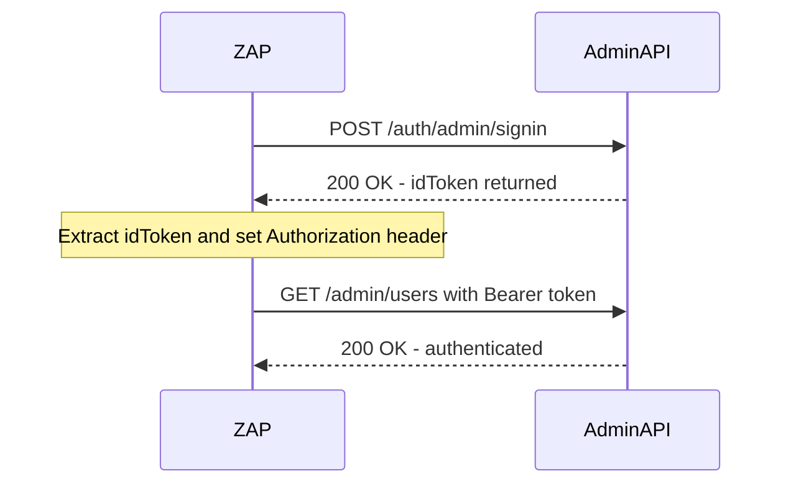
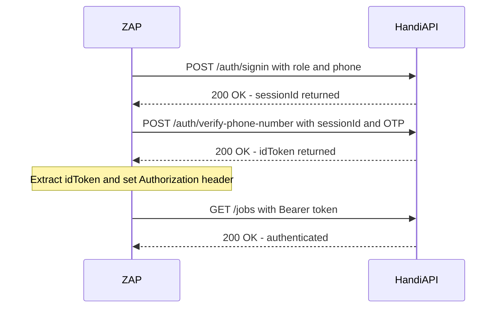

# Module 2: ZAP Automation Framework Plan

**File:** `.zap/automation.yml`

---

## Purpose

The ZAP Automation Framework plan is the **scan blueprint** — it tells ZAP exactly what to do when it starts: which authentication contexts to create, how to log in, what to crawl, what to scan, and what reports to generate.

This file is the heart of the scan logic. It defines **three parallel security perspectives** (Admin, User, Provider) that run sequentially, each with its own authentication and crawl/scan cycle.

---

## Flowchart: ZAP Automation Plan Execution

```mermaid
flowchart TD
    START([ZAP Starts]) --> IMPORT1[Import Admin Collection]
    IMPORT1 --> IMPORT2[Import User Collection]
    IMPORT2 --> PASSIVE_CONF[Configure Passive Scan]

    PASSIVE_CONF --> ADMIN_AUTH[Setup Admin Context]
    ADMIN_AUTH --> ADMIN_CRAWL[Admin Spider]
    ADMIN_CRAWL --> ADMIN_AJAX[Admin SpiderAjax]
    ADMIN_AJAX --> ADMIN_PASSIVE[Admin Passive Wait]
    ADMIN_PASSIVE --> ADMIN_ACTIVE[Admin Active Scan]

    ADMIN_ACTIVE --> USER_AUTH[Setup User Context]
    USER_AUTH --> USER_CRAWL[User Spider]
    USER_CRAWL --> USER_AJAX[User SpiderAjax]
    USER_AJAX --> USER_PASSIVE[User Passive Wait]
    USER_PASSIVE --> USER_ACTIVE[User Active Scan]

    USER_ACTIVE --> PROV_AUTH[Setup Provider Context]
    PROV_AUTH --> PROV_CRAWL[Provider Spider]
    PROV_CRAWL --> PROV_AJAX[Provider SpiderAjax]
    PROV_AJAX --> PROV_PASSIVE[Provider Passive Wait]
    PROV_PASSIVE --> PROV_ACTIVE[Provider Active Scan]

    PROV_ACTIVE --> REPORT_SARIF[Generate SARIF Report]
    REPORT_SARIF --> REPORT_HTML[Generate HTML Report]

    REPORT_HTML --> EXIT([Exit])

    style ADMIN_AUTH fill:#4dabf7,color:#fff
    style USER_AUTH fill:#69db7c,color:#000
    style PROV_AUTH fill:#ffd43b,color:#000
```

---

## Three Authentication Contexts

### Context: Admin

| Property | Value |
|----------|-------|
| **Auth Method** | `json` (single request) |
| **Login Endpoint** | `POST {TARGET_URL}/auth/admin/signin` |
| **Login Body** | `{"email":"","password":"{%password%"}` |
| **Session Management** | Header injection: `Authorization: Bearer ` |
| **Logged-in Regex** | `\Q"idToken"\E` |
| **Logged-out Regex** | `\Q"status":"error"\E\|\Q"statusCode":401\E` |
| **Credentials** | `username` = `DAST_ADMIN_USERNAME`, `password` = `DAST_ADMIN_PASSWORD` |

### Context: User

| Property | Value |
|----------|-------|
| **Auth Method** | `script` (custom Graal.js) |
| **Script** | `.zap/scripts/otp-signin-auth.js` |
| **Session Management** | Header injection: `Authorization: Bearer ` |
| **Credentials** | `Phone Number` = `DAST_USER_PHONE` |
| **Script Params** | `Base URL`, `Role: USER`, `OTP Code: DAST_TEST_OTP` |

### Context: Provider

| Property | Value |
|----------|-------|
| **Auth Method** | `script` (same custom Graal.js) |
| **Script** | `.zap/scripts/otp-signin-auth.js` |
| **Session Management** | Header injection: `Authorization: Bearer ` |
| **Credentials** | `Phone Number` = `DAST_PROVIDER_PHONE` |
| **Script Params** | `Base URL`, `Role: ARTISAN`, `OTP Code: DAST_TEST_OTP` |

---

## Scan Job Sequence

The jobs run **strictly sequentially** — each must complete before the next starts:

| # | Job | Duration | Notes |
|---|-----|----------|-------|
| 1 | Import Postman Collection (Admin) | Quick | Seeds Admin sitemap |
| 2 | Import Postman Collection (User) | Quick | Seeds User/Provider sitemap |
| 3 | Configure Passive Scan | Quick | Sets unlimited alerts per rule |
| 4 | Admin Spider | 5 min max | Traditional URL discovery |
| 5 | Admin SpiderAjax | 5 min max | JavaScript-rendered page discovery |
| 6 | Admin Passive Scan Wait | 5 min | Wait for passive scan to finish |
| 7 | Admin Active Scan | 35 min max | SQLi, XSS, etc. — 10 min/rule max |
| 8 | User Spider | 5 min max | — |
| 9 | User SpiderAjax | 5 min max | — |
| 10 | User Passive Scan Wait | 5 min | — |
| 11 | User Active Scan | 35 min max | — |
| 12 | Provider Spider | 5 min max | — |
| 13 | Provider SpiderAjax | 5 min max | — |
| 14 | Provider Passive Scan Wait | 5 min | — |
| 15 | Provider Active Scan | 35 min max | — |
| 16 | Generate SARIF Report | Quick | `zap-dast.json` |
| 17 | Generate HTML Report | Quick | `zap-dast-report.html` |

---

## Active Scan Configuration

| Setting | Value | Meaning |
|---------|-------|---------|
| Policy | `Default` | Standard ZAP ruleset |
| Strength | `Medium` | Balanced depth vs. speed |
| Threshold | `Medium` | Balanced false-positive vs. coverage |
| Max scan duration | 35 minutes | Per role |
| Max duration per rule | 10 minutes | Prevents one slow rule from dominating |

---

## Always-Excluded Paths

These paths are **hardcoded** in the automation plan (not toggled):

| Path Pattern | Reason |
|--------------|--------|
| `/admin/withdrawal-requests/*/approve` | Moves real money |
| `/admin/withdrawal-requests/*/reject` | Moves real money |
| `/admin/withdrawal-requests/*/fail` | Moves real money |
| `/admin/users/*/disable` | Bans real users |
| `/admin/users/*/enable` | Unbans real users |
| `/auth/logout` | Breaks session for subsequent contexts |
| `/auth/change-phone-number` | Irreversible account change |

---

## Report Generation

Two reports are generated:

| Format | File | Purpose |
|--------|------|---------|
| SARIF JSON | `zap-dast.json` | Machine-readable; uploaded to GitHub Code Scanning |
| Modern HTML | `zap-dast-report.html` | Human-readable; uploaded as workflow artifact |

---

## Environment Variables

ZAP receives these as environment variables (from GitHub Actions secrets):

| Variable | Used By |
|----------|---------|
| `TARGET_URL` | All contexts — base URL for API calls |
| `DAST_ADMIN_USERNAME` | Admin context — login email |
| `DAST_ADMIN_PASSWORD` | Admin context — login password |
| `DAST_USER_PHONE` | User context — phone number |
| `DAST_PROVIDER_PHONE` | Provider context — phone number |
| `DAST_TEST_OTP` | User/Provider contexts — fixed OTP code |

---

## Key Design Decisions

1. **Sequential, not parallel** — All three contexts run one after another on the same ZAP instance. This avoids resource contention and keeps the scan deterministic.

2. **Postman import before crawl** — Seeding the sitemap with known API routes ensures ZAP scans endpoints it would never discover through HTML link following alone.

3. **Medium strength/threshold** — Balanced settings avoid overwhelming the team with false positives while still catching real vulnerabilities.

4. **SpiderAjax per context** — JavaScript-rendered pages (if any) get discovered separately per authentication context.

5. **Passive scan wait between contexts** — Ensures passive rules (Information Disclosure, etc.) finish processing before the next context starts modifying requests.
