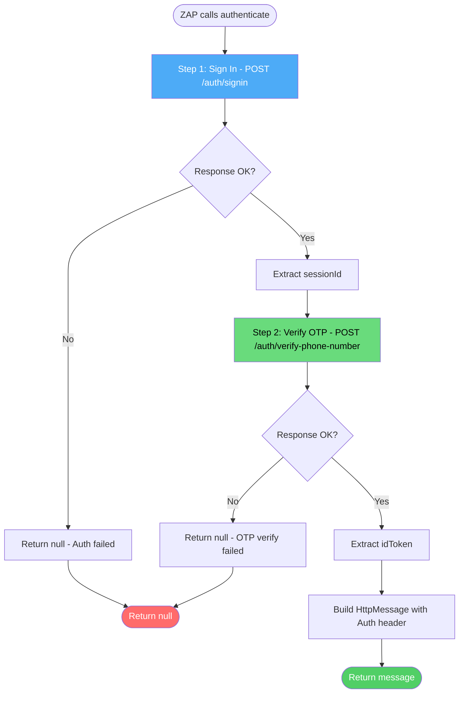

# Module 3: OTP Authentication Script

**File:** `.zap/scripts/otp-signin-auth.js`

---

## Purpose

OWASP ZAP's built-in `json` authentication method can only send **one HTTP request** per login. The Handi API requires a **two-step login**:

1. **Sign in** with phone number → receive a session ID
2. **Verify OTP** with session ID + code → receive an ID token

This custom Graal.js script implements that two-step flow so ZAP can authenticate as a User or Provider.

---

## Flowchart: OTP Authentication Script



---

## Script Interface (ZAP Scripting API)

The script must export these functions per ZAP's scripting contract:

| Function | Returns | Purpose |
|----------|---------|---------|
| `getRequiredParamsNames()` | `["Base URL", "Role", "OTP Code"]` | Parameters the script needs from the ZAP context |
| `getOptionalParamsNames()` | `[]` | No optional parameters |
| `getCredentialsParamsNames()` | `["Phone Number"]` | Credentials from the ZAP context's credential store |
| `authenticate(helper, paramsValues, credentials)` | `HttpMessage` or `null` | Performs the actual login |

---

## Login Flow Detail

### Step 1: Sign In

```
POST {baseUrl}/auth/signin
Content-Type: application/json

{
  "role": "USER" | "ARTISAN",
  "phoneNumber": "{Phone Number from credentials}"
}
```

**Expected Response:**
```json
{
  "status": "success",
  "data": {
    "sessionId": "abc123def456"
  }
}
```

**Extraction:** `sessionId` → stored for Step 2

### Step 2: Verify OTP

```
POST {baseUrl}/auth/verify-phone-number
Content-Type: application/json

{
  "sessionId": "abc123def456",
  "phoneNumber": "{Phone Number from credentials}",
  "code": "{OTP Code from script params}"
}
```

**Expected Response:**
```json
{
  "status": "success",
  "data": {
    "idToken": "eyJhbGciOiJSUzI1NiIs..."
  }
}
```

**Extraction:** `idToken` → used to build the authenticated request

### Session Management

After the script returns an `HttpMessage` containing the `idToken`, ZAP's `authhelper` add-on takes over:

- It extracts the token from the response
- Injects `Authorization: Bearer {idToken}` on all subsequent requests
- Monitors for 401 responses to re-authenticate

---

## Java Types Used

The script runs in Graal.js (JavaScript on the JVM via GraalVM) and uses ZAP's Java API:

| Java Type | Purpose |
|-----------|---------|
| `org.parosproxy.paros.network.HttpRequestHeader` | Construct HTTP request headers |
| `org.parosproxy.paros.network.HttpHeader` | Header constants (e.g., `CONTENT_TYPE`) |
| `org.apache.commons.httpclient.URI` | Construct request URIs |

---

## Helper Function: `jsonPost`

The script defines a reusable helper:

```javascript
function jsonPost(helper, url, bodyObj) {
    // 1. Create HttpMessage with URI
    // 2. Set method to POST
    // 3. Set Content-Type: application/json header
    // 4. Set request body as JSON string
    // 5. Send via helper.getHttpClient().sendAndReceive(msg)
    // 6. Return the response message
}
```

This abstracts the boilerplate of constructing HTTP requests in ZAP's Java API.

---

## Role Differentiation

The `Role` parameter controls which user type ZAP authenticates as:

| Role Value | User Type | Login Behavior |
|------------|-----------|----------------|
| `USER` | Regular customer | Posts jobs, hires artisans |
| `ARTISAN` | Service provider | Accepts jobs, sends quotes |

Both roles use the **same authentication script** — the only difference is the `role` field in the sign-in request body.

---

## ⚠️ Status: UNTESTED

> **This script is written against ZAP's documented scripting API but has NOT been tested against the real Handi API.**

Before relying on this in CI, it should be:

1. Loaded into **ZAP Desktop** manually
2. Tested with real credentials against the dev environment
3. Verified that the `idToken` extraction works
4. Confirmed that the `authhelper` add-on correctly injects the Bearer header
5. Verified the `loggedOutRegex` triggers re-authentication on 401

---

## Key Design Decisions

1. **Graal.js over Jython** — Graal.js is faster and better maintained than ZAP's Jython option. It also avoids Python versioning issues in Docker.

2. **Two separate requests instead of one** — The Handi API's OTP flow requires session state between steps. ZAP's `json` auth can't maintain that state, hence the custom script.

3. **Fixed OTP code** — The script uses a pre-shared OTP code (`DAST_TEST_OTP`) from secrets. This only works against the dev/staging environment where a fixed test OTP is configured.

4. **Null return on failure** — Returning `null` tells ZAP the login failed, triggering a retry or marking the context as unauthenticated.

5. **Bearer header via authhelper** — Rather than manually setting the header in every request, the script relies on the `authhelper` add-on for session management. This is cleaner and handles token refresh scenarios.
