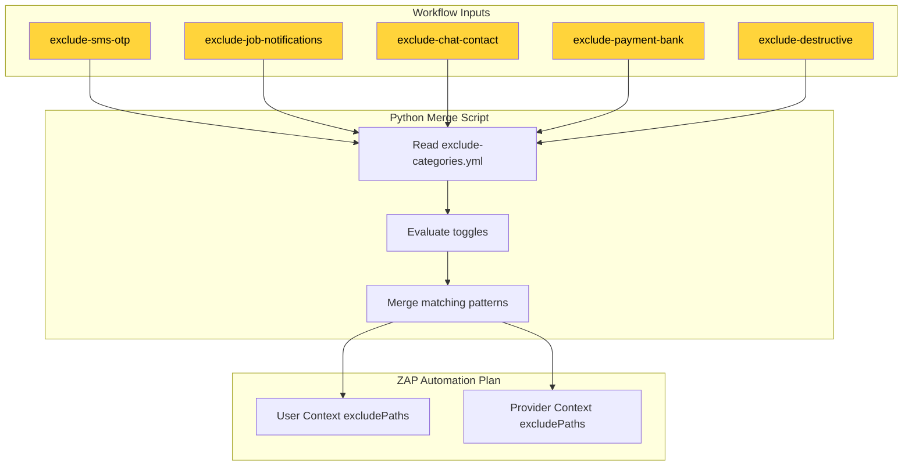
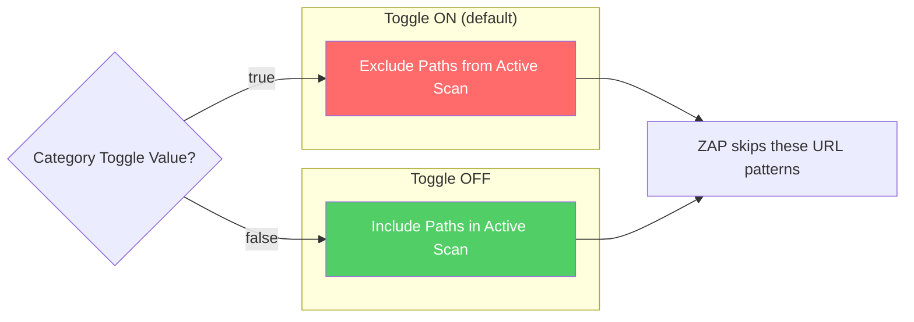
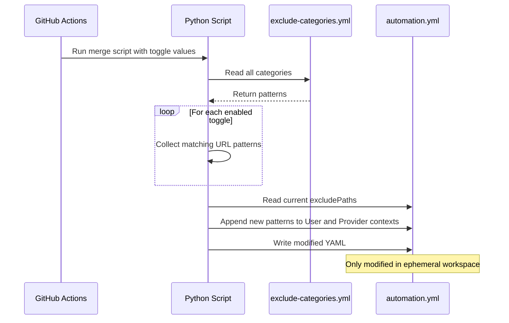

# Module 4: Exclusion Categories

**File:** `.zap/exclude-categories.yml`

---

## Purpose

The exclusion categories file defines URL patterns that ZAP should **skip during active scanning**, grouped by real-world risk category. Each category can be toggled on/off via workflow inputs, giving operators fine-grained control over which dangerous endpoints get scanned.

---

## Flowchart: Exclusion Category System

---

## Category Definitions

### `always` — Always Excluded (No Toggle)

These paths are **always excluded** regardless of toggle state. They are hardcoded in the automation plan.

| Pattern | Reason |
|---------|--------|
| `/auth/logout` | Breaks the authenticated session — scanning this would log ZAP out and break subsequent requests |
| `/auth/change-phone-number` | Irreversible account modification |
| `/admin/withdrawal-requests/*/approve` | Moves real money |
| `/admin/withdrawal-requests/*/reject` | Moves real money |
| `/admin/withdrawal-requests/*/fail` | Moves real money |
| `/admin/users/*/disable` | Bans real users |
| `/admin/users/*/enable` | Unbans real users |

---

### `sms-otp` — SMS/OTP Endpoints

| Toggle | `exclude-sms-otp` (default: `true`) |
|--------|-------------------------------------|

| Pattern | Reason |
|---------|--------|
| `/auth/resend-otp` | Each request sends a real SMS to the test phone number, incurring real cost and potential rate-limiting |

---

### `job-notifications` — Job Lifecycle Notifications

| Toggle | `exclude-job-notifications` (default: `true`) |
|--------|-----------------------------------------------|

| Pattern | Reason |
|---------|--------|
| `/jobs$` | Creating a job sends push notifications to all matching artisans |
| `/jobs/*/redispatch` | Redispatching notifies the original artisan and re-lists the job |
| `/job-quotes$` | Sending a quote notifies the job poster |
| `/jobs/complete/*` | Completing a job notifies both parties and triggers payment |
| `/jobs/artisan/cancel/*` | Cancellation notifies the job poster |
| `/jobs/user/cancel/*` | Cancellation notifies the artisan |

---

### `chat-contact` — Chat and Contact Endpoints

| Toggle | `exclude-chat-contact` (default: `true`) |
|--------|------------------------------------------|

| Pattern | Reason |
|---------|--------|
| `/chat/messages` | Sending messages reaches real chat inboxes |
| `/contact$` | Submits real contact form entries |
| `/v2/waitlist$` | Adds the test email to the real waitlist |

---

### `payment-bank` — Payment and Banking Endpoints

| Toggle | `exclude-payment-bank` (default: `true`) |
|--------|------------------------------------------|

| Pattern | Reason |
|---------|--------|
| `/payment/session` | Creates a real payment session with Paystack |
| `/wallet/resolve-account-number` | Hits the real banking API to resolve account details |
| `/withdrawal-requests$` | Creates a real withdrawal request |
| `/withdrawal-requests/referral` | Creates a real referral withdrawal |

---

### `destructive` — Irreversible Delete Operations

| Toggle | `exclude-destructive` (default: `true`) |
|--------|----------------------------------------|

| Pattern | Reason |
|---------|--------|
| `/artisan/services/[^/]+$` | Permanently deletes an artisan's service listing |
| `/withdrawal-requests/[^/]+$` | Permanently deletes a withdrawal request |

---

## Exclusion Flow

---

## ⚠️ Caveat: URL-Only Matching

> ZAP's `excludePaths` match by **URL pattern only**, not HTTP method.

This means:
- Excluding `/artisan/services/[^/]+$` prevents **all HTTP methods** (GET, POST, DELETE) on that pattern
- A GET request to read a service is excluded alongside the DELETE request to remove it
- This is an **accepted trade-off** for simplicity — the alternative (method-specific exclusions) requires per-endpoint configuration that's harder to maintain

---

## How Exclusions Are Applied

---

## Key Design Decisions

1. **Default ON (safest)** — All exclusions default to enabled. Teams must explicitly opt in to scan risky endpoints. This prevents accidental damage to staging environments.

2. **Category-based grouping** — Instead of individual toggles per endpoint, related endpoints are grouped by real-world consequence (SMS cost, push notifications, money movement). This makes the decision space manageable.

3. **User + Provider only** — The exclusion toggles only affect User and Provider contexts. The Admin context has its own hardcoded exclusions for money-moving and user-banning endpoints.

4. **Ephemeral merge** — The Python script modifies `automation.yml` in the GitHub Actions workspace, never in the committed file. This keeps the source of truth clean while allowing dynamic configuration.
