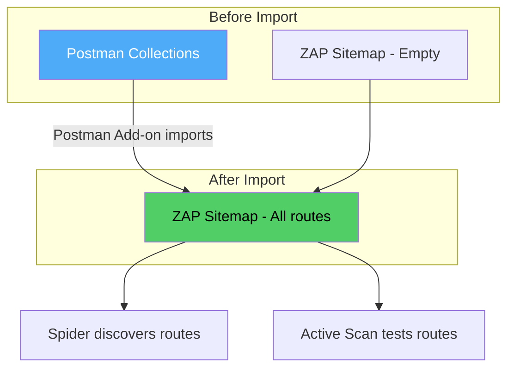
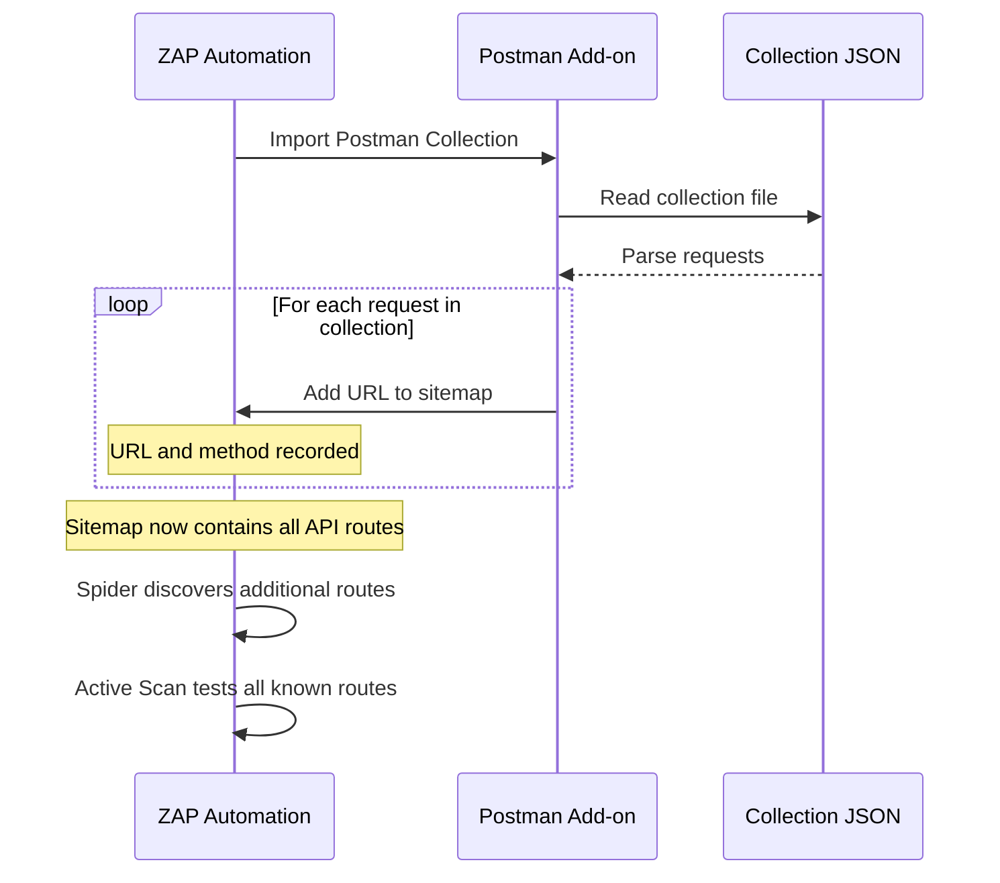

# Module 5: Postman Collections

**Files:** `.postman/collection-admin.json`, `.postman/collection-user.json`

---

## Purpose

The Postman collections serve as **API endpoint catalogs** that ZAP imports before crawling. Since ZAP's spider discovers endpoints by following HTML links (which don't exist in a pure API), importing real Postman collections **seeds ZAP's sitemap** with every known API route. This dramatically improves scan coverage.

---

## Flowchart: Postman Collection Role in Scan



---

## Collection: Admin API (`collection-admin.json`)

**Collection Name:** "Handi-Admin"  
**Total Requests:** 44  
**Auth:** Bearer token (`{{handi-admin-id-token}}`)

### Folder Structure

| Folder | Requests | Key Endpoints |
|--------|----------|---------------|
| Authentication | 2 | `POST /auth/admin/signin`, `GET /auth/me` |
| KYC | 2 | `GET /kyc/applications/:id`, `PUT /kyc/applications/:id/review` |
| Jobs | 10 | Stats, list, get, artisan jobs, cancel, complete, assign, timeline, payment, image URL |
| Transaction | 2 | Revenue stats, list transactions |
| Operations | 7 | Disable/enable user, artisans (list/detail/stats), upload URL, feature artisan |
| Disputes | 3 | Create, list, resolve |
| Users | 4 | List, summary, user jobs, get by ID |
| Withdrawal Requests | 4 | List, reject, approve, fail |
| Service Categories | 1 | Get categories |
| Analytics | 6 | Artisan analytics, user analytics, conversion, revenue, top categories, trend |
| Contact | 1 | List contact forms |
| Dashboard Summary | 1 | Get summary |

### Pre-request Script

The collection injects headers on every request:

```javascript
pm.request.headers.add({ key: 'X-Handi-Device-Id', value: 'xxx' });
pm.request.headers.add({ key: 'X-Handi-Platform', value: 'web' });
```

### Variable Resolution

| Variable | Source | Purpose |
|----------|--------|---------|
| `{{handi-admin-id-token}}` | Set by Sign In test script | Bearer token for Admin API |
| `{{baseUrl}}` | Environment variable | API base URL |

---

## Collection: User/Provider API (`collection-user.json`)

**Collection Name:** "Handi"  
**Total Requests:** 93  
**Auth:** Bearer token (`{{handi-id-token}}`)

### Folder Structure

| Folder | Requests | Key Endpoints |
|--------|----------|---------------|
| Onboarding | 9 | Sign in, complete onboarding, resend OTP, change phone, refresh token, verify phone/email, logout, get user |
| Notification | 4 | Settings CRUD, mark read, register push device |
| Wallet | 12 | Wallet, payment methods, banks, resolve account, withdrawal (normal + referral), payment session, earnings, cancel |
| Chat | 6 | List chats, get by ID, messages, send, upload/download, read |
| User | 7 | Address, profile, autocomplete, geocode, profile image, set PIN |
| Referral | 2 | Get code, get referred users |
| S3 | 1 | Upload sample (direct S3 PUT with AWS4-HMAC-SHA256) |
| Job | 14 | Create, redispatch, user/artisan jobs, get, pricing, image, categories, dispatches, quotes, complete, cancel |
| KYC | 3 | Application, upload URL, update |
| Artisan > Services | 4 | Create, image, list my services, list by artisan, delete |
| Artisan > Reviews | 2 | Get my ratings, get artisan reviews |
| Artisan > Settings | 4 | Online status, categories, availability, profile |
| Artisan (public) | 3 | Featured, popular, profile |
| Dev - Fast Track | 1 | Create verified artisan (dev-only) |
| Service Categories | 1 | Get categories |
| App | 2 | Get/update config |
| Contact | 2 | Subjects, submit form |
| Reports | 2 | Create job/chat report |
| Join Waitlist | 1 | POST `/v2/waitlist` |

### Pre-request Script

```javascript
pm.request.headers.add({ key: 'X-Handi-Device-Id', value: 'xxx' });
pm.request.headers.add({ key: 'X-Handi-Platform', value: 'ios' });
```

### Variable Resolution

| Variable | Source | Purpose |
|----------|--------|---------|
| `{{handi-id-token}}` | Set by Sign In test script | Bearer token for User/Provider API |
| `{{baseUrl}}` | Environment variable | API base URL |

---

## How ZAP Imports Collections



---

## Keeping Collections in Sync

The `.postman/README.md` documents the maintenance process:

1. **Export** from Postman (Collection v2.1 format)
2. **Strip response arrays** — Postman includes example responses in exports; these should be removed to keep the file small
3. **Commit** the updated collection to this repo
4. **Verify** that new endpoints appear in ZAP's sitemap after the next scan

---

## Collection Differences: Admin vs User/Provider

| Aspect | Admin | User/Provider |
|--------|-------|---------------|
| Auth method in ZAP | JSON (single request) | Script (two-step OTP) |
| Platform header | `web` | `ios` |
| Total endpoints | 44 | 93 |
| Focus | Management, analytics, moderation | Customer-facing, jobs, payments, chat |
| Dangerous endpoints | Withdrawal approve/reject, user disable/enable | Payment session, chat messages |

---

## Key Design Decisions

1. **Postman as ground truth** — The Postman collections are the most reliable source of API endpoint knowledge. They're maintained by the team that builds the API.

2. **Two collections, not one** — Separating Admin from User/Provider keeps the collections manageable and matches ZAP's context separation (Admin has different auth than User/Provider).

3. **Pre-request scripts preserved** — The `X-Handi-Device-Id` and `X-Handi-Platform` headers are required by the API. Keeping them in the collection ensures ZAP sends them during import and scanning.

4. **Dev-only endpoints included** — The `Dev - Fast Track` folder contains endpoints that only exist in dev. These are harmless to include — ZAP will get 404s in staging, which is fine.

5. **Response stripping** — Postman exports include example responses that bloat the file. Stripping them keeps the collection focused on endpoint definitions.
