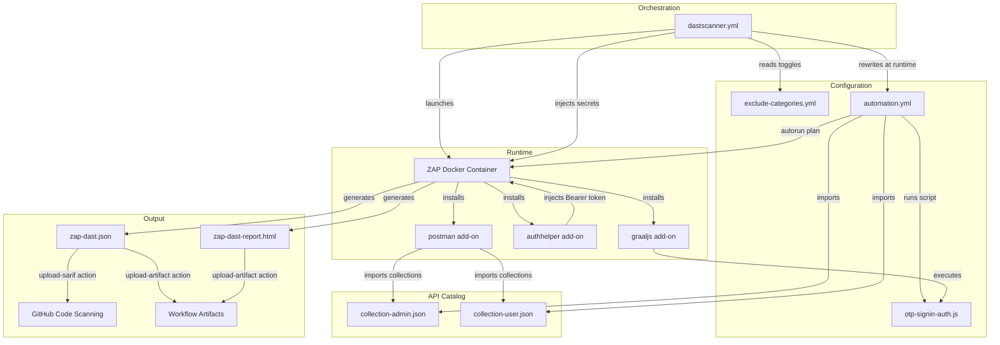
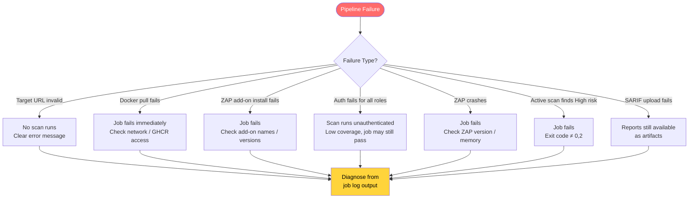

# Module 6: End-to-End Execution Flow

This document traces the **complete pipeline lifecycle** from trigger to report, showing how all modules interact.

---

## Master Flowchart

```mermaid
flowchart TD
    subgraph "Phase 1: Trigger & Validation"
        T1([Manual Trigger<br/>workflow_dispatch])
        T2([Scheduled Trigger<br/>cron: Mon-Fri 02:00 UTC])
        INPUTS[Collect Inputs<br/>target-url, allow-production,<br/>confirm-authorized, 5 toggles]
        RESOLVE[Resolve Target URL<br/>input → DAST_STAGING_URL fallback]
        VALIDATE{Valid?}
        REJECT[REJECT<br/>production gate or<br/>authorization missing]
    end

    subgraph "Phase 2: Configuration Merge"
        READ_EXCLUDE[Read .zap/exclude-categories.yml]
        EVAL_TOGGLES[Evaluate 5 Boolean Toggles]
        MERGE[Merge Selected Patterns<br/>into automation.yml]
        REWRITE[Rewrite automation.yml<br/>in ephemeral workspace]
    end

    subgraph "Phase 3: ZAP Launch"
        DOCKER[Launch Docker Container<br/>ghcr.io/zaproxy/zaproxy:stable]
        ADDONS[Install Add-ons<br/>postman, authhelper, graaljs]
        AUTORUN[Run: zap.sh -cmd<br/>-autorun .zap/automation.yml]
    end

    subgraph "Phase 4: Scan Execution"
        IMPORT_SEED[Import Postman Collections<br/>Seed Sitemap]
        
        subgraph "Admin Context"
            ADMIN_AUTH[Admin Login<br/>JSON → POST /auth/admin/signin]
            ADMIN_SPIDER[Admin Spider<br/>5 min]
            ADMIN_AJAX[Admin SpiderAjax<br/>5 min]
            ADMIN_PASSIVE[Passive Scan Wait<br/>5 min]
            ADMIN_ACTIVE[Admin Active Scan<br/>35 min]
        end

        subgraph "User Context"
            USER_AUTH[User Login<br/>Script → Phone + OTP]
            USER_SPIDER[User Spider<br/>5 min]
            USER_AJAX[User SpiderAjax<br/>5 min]
            USER_PASSIVE[Passive Scan Wait<br/>5 min]
            USER_ACTIVE[User Active Scan<br/>35 min]
        end

        subgraph "Provider Context"
            PROV_AUTH[Provider Login<br/>Script → Phone + OTP<br/>Role: ARTISAN]
            PROV_SPIDER[Provider Spider<br/>5 min]
            PROV_AJAX[Provider SpiderAjax<br/>5 min]
            PROV_PASSIVE[Passive Scan Wait<br/>5 min]
            PROV_ACTIVE[Provider Active Scan<br/>35 min]
        end
    end

    subgraph "Phase 5: Report & Upload"
        SARIF_GEN[Generate SARIF<br/>zap-dast.json]
        HTML_GEN[Generate HTML<br/>zap-dast-report.html]
        UPLOAD_SARIF[Upload to GitHub<br/>Code Scanning]
        UPLOAD_ARTIFACT[Upload as Artifacts<br/>30-day retention]
        EXIT_CODE{ZAP Exit Code}
        PASS([✅ Pass])
        WARN([⚠️ Warning])
        FAIL([❌ Fail])
    end

    T1 --> INPUTS
    T2 --> INPUTS
    INPUTS --> RESOLVE --> VALIDATE
    VALIDATE -->|Invalid| REJECT
    VALIDATE -->|Valid| READ_EXCLUDE

    READ_EXCLUDE --> EVAL_TOGGLES --> MERGE --> REWRITE
    REWRITE --> DOCKER --> ADDONS --> AUTORUN
    AUTORUN --> IMPORT_SEED

    IMPORT_SEED --> ADMIN_AUTH --> ADMIN_SPIDER --> ADMIN_AJAX --> ADMIN_PASSIVE --> ADMIN_ACTIVE
    ADMIN_ACTIVE --> USER_AUTH --> USER_SPIDER --> USER_AJAX --> USER_PASSIVE --> USER_ACTIVE
    USER_ACTIVE --> PROV_AUTH --> PROV_SPIDER --> PROV_AJAX --> PROV_PASSIVE --> PROV_ACTIVE

    PROV_ACTIVE --> SARIF_GEN --> HTML_GEN
    HTML_GEN --> UPLOAD_SARIF --> UPLOAD_ARTIFACT --> EXIT_CODE
    EXIT_CODE -->|0| PASS
    EXIT_CODE -->|2| WARN
    EXIT_CODE -->|other| FAIL

    style REJECT fill:#ff6b6b,color:#fff
    style PASS fill:#51cf66,color:#fff
    style WARN fill:#ffd43b,color:#000
    style FAIL fill:#ff6b6b,color:#fff
```



---

## Module Interaction Map



---

## Timing Breakdown


**Estimated total:** ~100–110 minutes (with generous timeouts)

---

## Data Flow Through the Pipeline

```mermaid
flowchart LR
    subgraph "Input Data"
        SECRETS[GitHub Secrets<br/>credentials]
        TOGGLES[Workflow Inputs<br/>exclusion toggles]
        URL[Target URL<br/>staging endpoint]
    end

    subgraph "Static Config"
        AUTOMATION_YML["automation.yml<br/>(scan plan)"]
        EXCLUDE_YML["exclude-categories.yml<br/>(exclusion patterns)"]
        POSTMAN_A["collection-admin.json<br/>(44 endpoints)"]
        POSTMAN_U["collection-user.json<br/>(93 endpoints)"]
        OTP_JS["otp-signin-auth.js<br/>(auth script)"]
    end

    subgraph "Runtime Artifacts"
        MODIFIED_YML["automation.yml<br/>(merged exclusions)"]
        ZAP_LOG[ZAP Scan Log]
    end

    subgraph "Output Data"
        SARIF_OUT["zap-dast.json<br/>(SARIF findings)"]
        HTML_OUT["zap-dast-report.html<br/>(human-readable report)"]
    end

    subgraph "External Systems"
        GITHUB_SC[GITHUB_CODE_SCANNING<br/>(SARIF ingestion)]
        ARTIFACTS[Workflow Artifacts<br/>(30-day retention)]
    end

    SECRETS --> ZAP_LOG
    TOGGLES --> MODIFIED_YML
    URL --> ZAP_LOG
    AUTOMATION_YML --> MODIFIED_YML
    EXCLUDE_YML --> MODIFIED_YML
    POSTMAN_A --> ZAP_LOG
    POSTMAN_U --> ZAP_LOG
    OTP_JS --> ZAP_LOG
    MODIFIED_YML --> ZAP_LOG
    ZAP_LOG --> SARIF_OUT
    ZAP_LOG --> HTML_OUT
    SARIF_OUT --> GITHUB_SC
    SARIF_OUT --> ARTIFACTS
    HTML_OUT --> ARTIFACTS
```

---

## Security Controls in the Pipeline

| Control | Layer | Purpose |
|---------|-------|---------|
| SHA-pinned Actions | Supply chain | Prevents tag-switching attacks on GitHub Actions |
| `permissions: contents: read` | Least privilege | Minimizes token scope |
| `confirm-authorized` input | Human gate | Prevents accidental scans |
| `allow-production` gate | Safety | Blocks prod URLs by default |
| Exclusion categories | Risk mitigation | Prevents scanning dangerous endpoints |
| ZAP exit codes | Fail-fast | High-risk findings block the pipeline |
| SARIF upload | Visibility | Findings appear in GitHub Security tab |
| 30-day artifact retention | Audit trail | Reports available for review |

---

## Failure Modes



---

## Key Observations

1. **No application source code** — This repo contains zero application code. It's purely security testing infrastructure. The Postman collections are the only representation of the target API.

2. **New repository** — Only 2 git commits exist. This is a fresh project.

3. **Untested OTP script** — The custom authentication script has not been validated against the real API. Manual ZAP Desktop testing is required before CI reliance.

4. **~2 hour runtime** — The three-role sequential scan with generous timeouts means each run takes approximately 100–110 minutes. The 240-minute timeout provides headroom.

5. **ARM runner** — Using `ubuntu-24.04-arm` for cost efficiency. The ZAP Docker image supports ARM natively.
