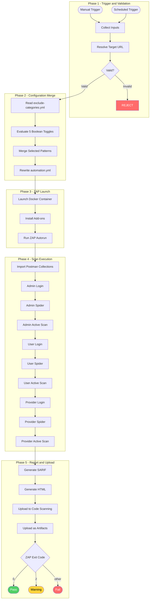
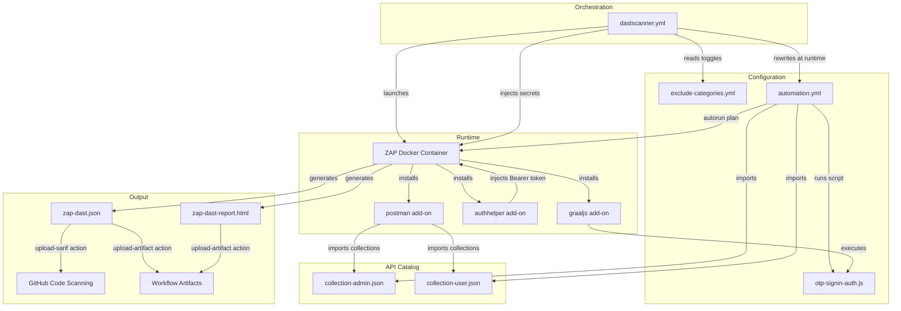
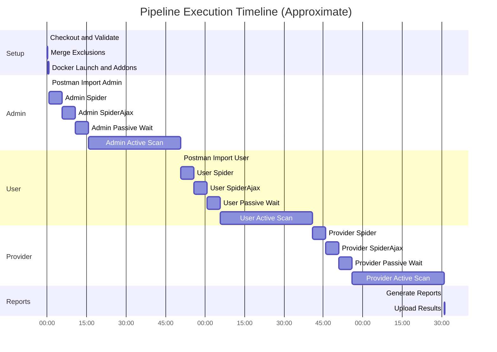
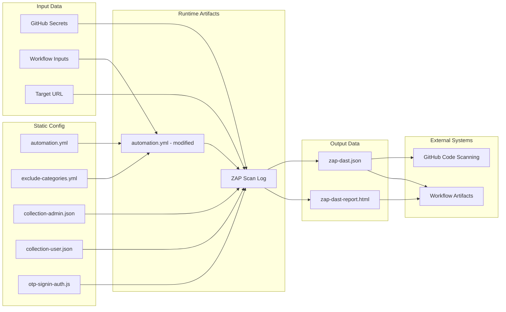
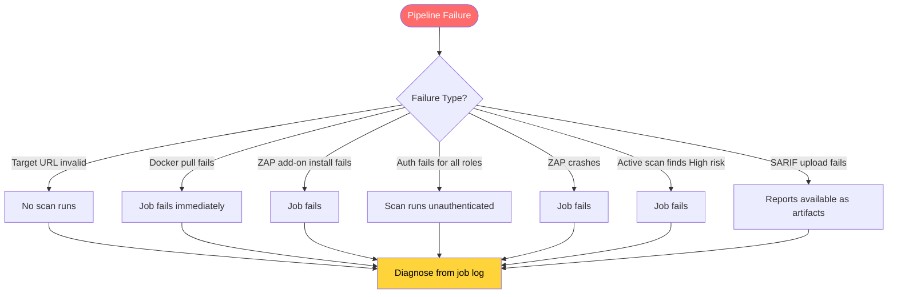

# Module 6: End-to-End Execution Flow

This document traces the **complete pipeline lifecycle** from trigger to report, showing how all modules interact.

---

## Master Flowchart

---

## Module Interaction Map

---

## Timing Breakdown

**Estimated total:** ~100–110 minutes (with generous timeouts)

---

## Data Flow Through the Pipeline

---

## Security Controls in the Pipeline

| Control | Layer | Purpose |
|---------|-------|---------|
| SHA-pinned Actions | Supply chain | Prevents tag-switching attacks on GitHub Actions |
| `permissions: contents: read` | Least privilege | Minimizes token scope |
| `confirm-authorized` input | Human gate | Prevents accidental scans |
| `allow-production` gate | Safety | Blocks prod URLs by default |
| Exclusion categories | Risk mitigation | Prevents scanning dangerous endpoints |
| ZAP exit codes | Fail-fast | High-risk findings block the pipeline |
| SARIF upload | Visibility | Findings appear in GitHub Security tab |
| 30-day artifact retention | Audit trail | Reports available for review |

---

## Failure Modes

---

## Key Observations

1. **No application source code** — This repo contains zero application code. It's purely security testing infrastructure. The Postman collections are the only representation of the target API.

2. **New repository** — Only 2 git commits exist. This is a fresh project.

3. **Untested OTP script** — The custom authentication script has not been validated against the real API. Manual ZAP Desktop testing is required before CI reliance.

4. **~2 hour runtime** — The three-role sequential scan with generous timeouts means each run takes approximately 100–110 minutes. The 240-minute timeout provides headroom.

5. **ARM runner** — Using `ubuntu-24.04-arm` for cost efficiency. The ZAP Docker image supports ARM natively.
