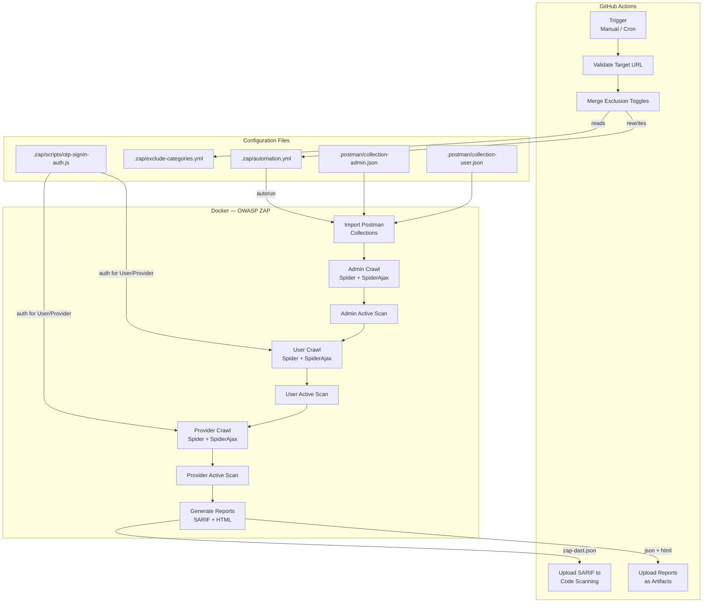

# DASTSCANNER — Module Documentation Index

> **Automated Dynamic Application Security Testing pipeline for the Handi API marketplace**

---

## Project at a Glance

DASTSCANNER is a GitHub Actions–driven DAST pipeline that uses **OWASP ZAP** (in Docker) to perform authenticated, multi-role security scanning against the **Handi** API — a Nigerian service marketplace connecting users with artisans.

The scanner tests from three perspectives simultaneously:

| Role | Login Method | What It Tests |
|------|-------------|---------------|
| **Admin** | JSON single-request auth | Platform management endpoints, RBAC |
| **User** | Two-step phone + OTP script | Customer-facing endpoints, wallet, jobs |
| **Provider (Artisan)** | Two-step phone + OTP script | Service management, quotes, earnings |

---

## Module Documentation

| # | Module | File | Description |
|---|--------|------|-------------|
| 1 | [GitHub Actions Workflow](./01-github-actions-workflow.md) | `dastscanner.yml` | CI/CD orchestrator — triggers, safety gates, Docker launch, reporting |
| 2 | [ZAP Automation Plan](./02-zap-automation-plan.md) | `.zap/automation.yml` | Scan plan — three auth contexts, crawl/scan jobs, report generation |
| 3 | [OTP Authentication Script](./03-otp-auth-script.md) | `.zap/scripts/otp-signin-auth.js` | Custom Graal.js script for two-step phone+OTP login |
| 4 | [Exclusion Categories](./04-exclusion-categories.md) | `.zap/exclude-categories.yml` | URL exclusion patterns toggled by risk category |
| 5 | [Postman Collections](./05-postman-collections.md) | `.postman/` | API endpoint definitions used to seed ZAP's sitemap |
| 6 | [End-to-End Execution Flow](./06-execution-flow.md) | *(cross-cutting)* | Complete pipeline flow from trigger to report with flowcharts |

---

## Architecture Diagram



---

## Configuration Files Summary

| File | Format | Purpose |
|------|--------|---------|
| `dastscanner.yml` | GitHub Actions YAML | Pipeline definition (trigger, gates, Docker, reporting) |
| `.zap/automation.yml` | ZAP Automation YAML | Scan plan (contexts, jobs, reports) |
| `.zap/exclude-categories.yml` | YAML | URL exclusion patterns grouped by risk |
| `.zap/scripts/otp-signin-auth.js` | Graal.js | Custom two-step phone+OTP authentication |
| `.postman/collection-admin.json` | Postman v2.1 | Admin API endpoints (44 requests) |
| `.postman/collection-user.json` | Postman v2.1 | User/Provider API endpoints (93 requests) |

---

## Required Secrets

| Secret | Purpose |
|--------|---------|
| `DAST_ADMIN_USERNAME` | Admin login email |
| `DAST_ADMIN_PASSWORD` | Admin login password |
| `DAST_USER_PHONE` | Test user phone number |
| `DAST_PROVIDER_PHONE` | Test artisan phone number |
| `DAST_TEST_OTP` | Fixed OTP code for dev environment |

---

## Safety Model

The pipeline has **three layers of protection**:

1. **URL Pattern Exclusions** — Destructive/dangerous endpoints are always excluded
2. **Category Toggles** — Risky categories default to ON (safest), opt-in to scan
3. **Production Gate** — Requires `allow-production: true` + `confirm-authorized: yes`

```
┌─────────────────────────────────────────────────────┐
│                   SAFETY LAYERS                     │
├─────────────────────────────────────────────────────┤
│                                                     │
│  Layer 1: Always-Excluded Paths                     │
│  ├── /auth/logout                                   │
│  ├── /auth/change-phone-number                      │
│  ├── /admin/withdrawal-requests/*/approve           │
│  └── /admin/users/*/disable                         │
│                                                     │
│  Layer 2: Toggleable Categories (default: ON)       │
│  ├── sms-otp              → /auth/resend-otp        │
│  ├── job-notifications    → /jobs, /job-quotes      │
│  ├── chat-contact         → /chat, /contact         │
│  ├── payment-bank         → /payment, /wallet       │
│  └── destructive          → DELETE endpoints         │
│                                                     │
│  Layer 3: Production Safety Gate                    │
│  ├── URL must not contain "prod"                    │
│  ├── Unless allow-production: true                  │
│  └── confirm-authorized must equal "yes"            │
│                                                     │
└─────────────────────────────────────────────────────┘
```
